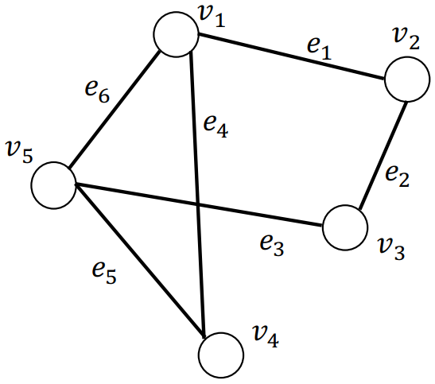
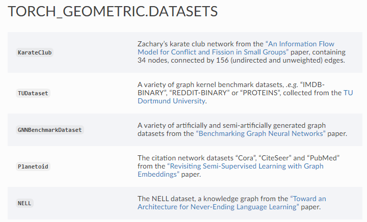

# 图论的基本知识
图论（Graph Theory）是数学的一个分支。它以图为研究对象。图论中的图是由若干给定的点及连接两点的线所构成的图形，这种图形通常用来描述某些实体之间的某种特定关系，用点代表实体，用连接两点的线表示两个实体间具有的某种关系。  
相比矩阵、张量、序列等结构，图结构可以有效建模和解决社会关系、交通网络、文法结构和论文引用等需要考虑实体间关系的各种实际问题。因此，为了能够有效利用图结构这种工具，我们必须要对图的定义、类型和性质有一定的认识。  
## 图的基本表示（Graph Representations）
### 图（Graph）
图可以被表示为 G={V, E}，其中 V={v<sub>1</sub>, ... , v<sub>N</sub>}，E= {e<sub>1</sub>, ... , e<sub>M</sub>}。    
  

### 图的邻接矩阵（Adjacency Matrix）
图可使用邻接矩阵 A ∈ {0, 1}<sup>N×N</sup> 来表示。A<sub>i,j </sub> 表示节点 v<sub>i</sub>和 v<sub>j</sub> 是否连接（无向无权图）。  
  

## 图的基本属性和度量（Properties and Measures）
### 节点（Node）
* 度（Degree）：与节点 V<sub>i</sub> 连接的节点数量。  
* 邻居（Neighbors）：与节点 V<sub>i</sub> 连接的节点集合。  
* 中心性（Centrality）：度量节点的重要性，有度中心性、特征向量中心性、Katz中心性、中介中心性。  
### 节点对（Pairwise Nodes）
* 行走（Walk）：开始于节点 u，结束于节点 v 的所有可能的序列（Node-Edge-...-Node）。  
* 足迹（Trial）：没有重复边的行走。  
* 路径（Path）：没有重复节点的行走。  
* 最短路径（Shortest Path）：两节点间长度最短的路径，可能会超过一条。  
### 图（Graph）
* n阶邻接矩阵：矩阵 A<sup>n</sup> 的 元素 A<sub>i,j</sub> 等于长度为n的 v<sub>i</sub> - v<sub>j</sub> 行走的数量。  
* 子图（Subgraph）：由图中部分节点以及这些节点间的边组成的图。  
* 连通分量（Connected Component）：各节点间至少存在一条边可以连通。  
* 连通图（Connected Graph）：只包含一个连通分量，即其自身，那么该图是一个连通图。  
  
* 直径（Diameter）：各节点之间的最短路径长度中的最大值。  

## 高级的图结构
以上介绍的是简单图结构及其属性，但是真实世界中的图要更加复杂。  
### 异质图（Heterogeneous Graphs）
图中的每个节点和边都有多种类型，如下图所示：  

### 二部图（Bipartite Graphs）
节点分为两类，只有不同类的节点之间存在边。比如，消费者和商品的购买关系。  
### 多维图（Multi-dimensional graph）
节点之间可以同时存在多种类型的关系，需要使用多个邻接矩阵表示。比如消费者和商品之间的点击、购买和评论等关系。  
### 符号图（signed Graphs）
节点之间同时存在正向和负向的边。比如社交网络中，关注某个人和屏蔽某个人是相对的（+1，-1），暂时未有过交互的为0。  

### 超图（Hypergraphs）
每一条边可以包含两个以上的节点所构成的图。比如一篇论文可能有两个以上的作者产生关系。  

### 动态图（Dynamic Graphs）
考虑节点和边随时间的变化的图。  


# 图结构与机器学习
著名的图灵奖得主尼古拉斯·沃斯提出过一个著名的等式：程序 = 算法 + 数据结构。因此，图结构这种非规则非结构化的数据形式也就无法直接使用过去应用在矩阵、序列等数据形式上的算法。  
新颖的数据结构在机器学习中的应用，将会带来新的问题、方法和挑战。  

## 图结构数据上的机器学习任务


1. 节点预测：预测节点的类别或某类属性的取值
    * 例子：潜在客户分类、游戏玩家的消费能力预测
2. 边预测：预测两个节点间是否存在连接
    * 例子：Knowledge graph completion、好友推荐、商品推荐
3. 图预测：对不同的图进行分类或预测图的属性
    * 例子：分子属性预测
4. 节点聚类：检测节点是否形成一个社区
    * 例子：社交圈检测
5. 其他任务
    * 图生成：例如药物发现
    * 图演变：例如物理模拟
    * ……
## 应用神经网络于图面临的挑战
图结构有以下特点：
1. 任意的大小和复杂的拓扑结构；
2. 没有固定的结点排序或参考点；
3. 通常是动态的，并具有多模态的特征；
4. 图的信息并非只蕴含在节点信息和边的信息中，图的信息还包括了图的拓扑结构。
若要在图结构数据上使用神经网络，要求：
1. 适用于不同度的节点；
2. 节点表征的计算与邻接节点的排序无关；
3. 不但能够根据节点信息、邻接节点的信息和边的信息计算节点表征，还能根据图拓扑结构计算节点表征。
# 图结构的分析环境
PyTorch Geometric (PyG) 是面向几何深度学习的 PyTorch 的扩展库，几何深度学习指的是应用于图和其他不规则、非结构化数据的深度学习。基于PyG库，我们可以轻松完成图数据和图数据集的表示和使用。  
为了顺利使用 PyG，我们需要选择使用的操作系统、Python版本及IDE、PyTorch库版本、CPU/GPU及其配置库，如果各项不匹配就会导致错误。  
## 操作系统
主流的为Windows、Linux和Mac。据说Windows配置较为简单，Mac比较麻烦，且不支持GPU。  本机使用的操作系统为Windows 10 专业版 64位。  
## Python
本机使用 Anaconda 创建虚拟环境 Datawhale 来配置，Python版本为 3.8.10 64位。  
注意：Python版本较高，若使用Pycharm的话需要注意其版本是否过低。建议下载最新的Pycharm或者使用 jupyter notebook。  
本机使用 jupyter notebook 和 PyCharm Community Edition 2021.1.2 均可顺利运行。  
## CPU/GPU
本机的 GPU 版本较低，难以和最新的 CUDA 相适配，故选择使用 CPU 作为数据处理器。  
GPU在处理大规模数据的时候可以加快计算速度，但在小规模数据上，和CPU差不多。  
## PyTorch
本机的 PyTorch 选择了最新的 1.8.1 版本，可以使用 conda install 命令安装。具体的安装命令根据配置的要求而变化，详情可以访问 [pytorch 官网](https://pytorch.org/)，本机的选择如下所示：  
  
确认是否安装成功，可以在conda环境中输入以下命令：   

```python
python -c "import torch; print(torch.__version__)"  #本机返回1.8.1  
python -c "import torch; print(torch.version.cuda)" #CPU模式返回NA

# 成功后继续安装正确版本的PyG：  
pip install torch-scatter -f https://pytorch-geometric.com/whl/torch-1.8.0+cpu.html # 若使用gpu，"cpu"可更改为cu92, cu101, cu102, cu110, cu111等
pip install torch-sparse -f https://pytorch-geometric.com/whl/torch-1.8.0+cpu.html
pip install torch-cluster -f https://pytorch-geometric.com/whl/torch-1.8.0+cpu.html
pip install torch-spline-conv -f https://pytorch-geometric.com/whl/torch-1.8.0+cpu.html
pip install torch-geometric
```
其他版本的安装方法以及安装过程中出现的大部分问题的解决方案可以在 [Installation of of PyTorch Geometric](https://pytorch-geometric.readthedocs.io/en/latest/notes/installation.html) 页面找到。  
安装后若能正常 import torch-geometric 即可认为成功。

# 图结构的处理实践
## Data类——PyG中图的表示及其使用
### 认识 torch_geometric.data
使用一个对象类别之前要了解它的内部构造：
	CLASSData(x=None, edge_index=None, edge_attr=None, y=None, pos=None, normal=None, face=None, **kwargs)
* **x (Tensor, optional)**：节点特征矩阵 [num_nodes, num_node_features]。 (default: None)
* **edge_index (LongTensor, optional)**： 边索引矩阵 [2, num_edges]. (default: None)。第0行为尾节点，第1行为头节点
* **edge_attr (Tensor, optional)**： 边特征矩阵  [num_edges, num_edge_features]。(default: None)
* **y (Tensor, optional)**： 节点或图的标签，任意大小。 (default: None)
数据对象不限于这些属性，可以由任何其他附加数据进行扩展。[可在此查看更详细的定义](https://pytorch-geometric.readthedocs.io/en/latest/modules/data.html#torch_geometric.data.Data)，包括内部构造和可调用的方法。  
### data类的简单调用
```python
from torch_geometric.datasets import KarateClub
dataset = KarateClub()
data = dataset[0]  # Get the first graph object.

print(data)
# Data(edge_index=[2, 156], train_mask=[34], x=[34, 34], y=[34])  
	
# 获取图的一些信息  
print(f'Number of nodes: {data.num_nodes}') # 节点数量
# Number of nodes: 34 
	
print(f'Number of edges: {data.num_edges}') # 边数量
# Number of edges: 156
	
print(f'Number of node features: {data.num_node_features}') # 节点属性的维度
# Number of node features: 34
	
print(f'Number of node features: {data.num_features}') # 同样是节点属性的维度
# Number of node features: 34
	
print(f'Number of edge features: {data.num_edge_features}') # 边属性的维度
# Number of edge features: 0
	
print(f'Average node degree: {data.num_edges / data.num_nodes:.2f}') # 平均节点度
# Average node degree: 4.59
	
print(f'if edge indices are ordered and do not contain duplicate entries.: {data.is_coalesced()}') # 是否边是有序的同时不含有重复的边
# if edge indices are ordered and do not contain duplicate entries.: True
	
print(f'Number of training nodes: {data.train_mask.sum()}') # 用作训练集的节点
# Number of training nodes: 4
	
print(f'Training node label rate: {int(data.train_mask.sum()) / data.num_nodes:.2f}') # 用作训练集的节点的数量
# Training node label rate: 0.12
	
print(f'Contains isolated nodes: {data.contains_isolated_nodes()}') # 此图是否包含孤立的节点
# Contains isolated nodes: False
	
print(f'Contains self-loops: {data.contains_self_loops()}')  # 此图是否包含自环的边
# Contains self-loops: False
	
print(f'Is undirected: {data.is_undirected()}')  # 此图是否是无向图
# Is undirected: True #
```
## Dataset类——PyG中图数据集的表示及其使用
### 认识 torch_geometric.datasets
PyG内置了大量常用的基准数据集，均可以通过datasets来调用，如下所示：  
  

### datasets中数据的调用
接下来我们以PyG内置的Planetoid数据集为例来学习。  
Planetoid数据集类的官方文档为 [torch_geometric.datasets.Planetoid](https://pytorch-geometric.readthedocs.io/en/latest/modules/datasets.html#torch_geometric.datasets.Planetoid)。  
```python
from torch_geometric.datasets import Planetoid
dataset = Planetoid(root='./tmp/cora', name='Cora') # 默认源为GitHub，国内网速很慢。把planetoid.py里面第48行的 url = 'https://github.com/kimiyoung/planetoid/raw/master/data' 改成 url='https://gitee.com/jiajiewu/planetoid/raw/master/data' 可以解决这个问题

len(dataset)
# 1

dataset.num_classes
# 7

dataset.num_node_features
# 1433

data = dataset[0]
print(data)
# Data(edge_index=[2, 10556], test_mask=[2708], train_mask=[2708], val_mask=[2708], x=[2708, 1433], y=[2708])

data.is_undirected()
# True

data.train_mask.sum().item()
# 140

data.val_mask.sum().item()
# 500

data.test_mask.sum().item()
# 1000
```
## 作业实践——“机构-作者-论文”网络的构建
请通过继承Data类实现一个类，专门用于表示“机构-作者-论文”的网络。该网络包含“机构“、”作者“和”论文”三类节点，以及“作者-机构“和“作者-论文“两类边。对要实现的类的要求：1）用不同的属性存储不同节点的属性；2）用不同的属性存储不同的边（边没有属性）；3）逐一实现获取不同节点数量的方法。  
根据 Datawhale 讲师陈荣钦的指导， 首先要在继承Data类的基础上定义新类的结构，然后定义属性方法，如下所示：  

```python
class MyData(Data):
    def __init__(self, institution_x, author_x, paper_x, work_edge_index, publish_edge_index, work_edge_attr, publish_edge_attr, y, **kwargs):
        super().__init__(**kwargs)
        
        self.institution_x = institution_x
        self.author_x = author_x
        self.paper_x = paper_x
        self.work_edge_index = work_edge_index
        self.publish_edge_index = publish_edge_index
        self.work_edge_attr = work_edge_attr
        self.publish_edge_attr = publish_edge_attr
        self.y = y
        
    @property
    def num_nodes_institution(self):
        return self.institution_x.shape[0]
    
    @property
    def num_nodes_author(self):
        return self.author_x.shape[0]
        
    @property
    def num_nodes_paper(self):
        return self.paper_x.shape[0]
```
# 参考资料
1. [Chapter 2 - Foundations of Graphs, Deep Learning on Graphs](https://cse.msu.edu/~mayao4/dlg_book/chapters/chapter2.pd)
2. [Datawhale 学习社区的 github 教程](https://github.com/datawhalechina/team-learning)
3. [Planetoid无法直接下载Cora等数据集的3个解决方式](https://blog.csdn.net/PolarisRisingWar/article/details/116399648)